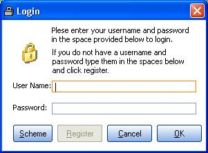



## AALogin

### Description

Would you like to add an XP style login to your application? This login will allow you to register and will not allow duplicate usernames. You can also change the color scheme at login. You will need OsenXPSuite for this app. Uses ADO to connect to the Access database.
 
### More Info
 

             |
---                |---
**Submitted On**   |2005-07-02 10:12:14
**By**             |[Jason McGill](https://github.com/Planet-Source-Code/PSCIndex/blob/master/ByAuthor/jason-mcgill.md)
**Level**          |Beginner
**User Rating**    |4.3 (13 globes from 3 users)
**Compatibility**  |VB 6\.0
**Category**       |[Databases/ Data Access/ DAO/ ADO](https://github.com/Planet-Source-Code/PSCIndex/blob/master/ByCategory/databases-data-access-dao-ado__1-6.md)
**World**          |[Visual Basic](https://github.com/Planet-Source-Code/PSCIndex/blob/master/ByWorld/visual-basic.md)
**Archive File**   |[AALogin190819722005\.zip](https://github.com/Planet-Source-Code/jason-mcgill-aalogin__1-61466/archive/master.zip)

